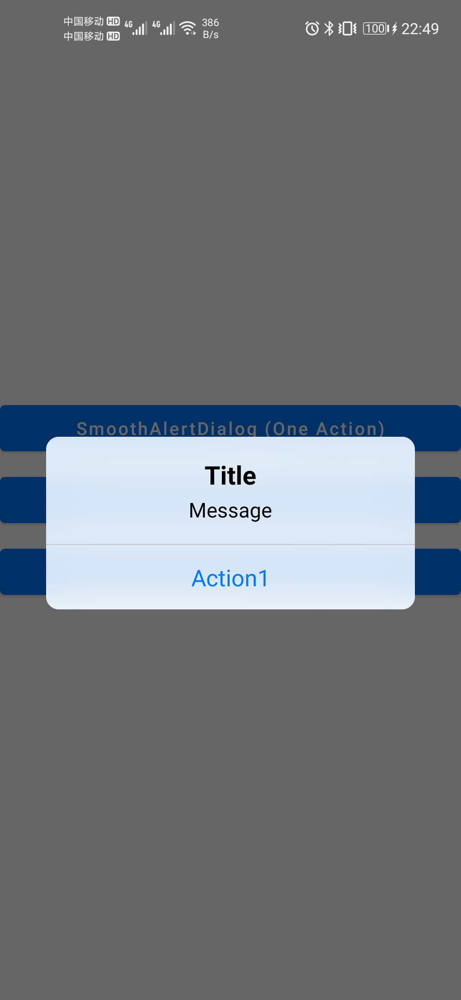
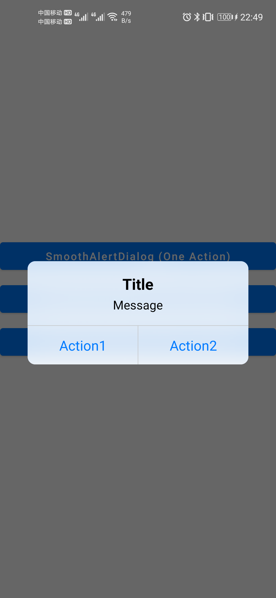
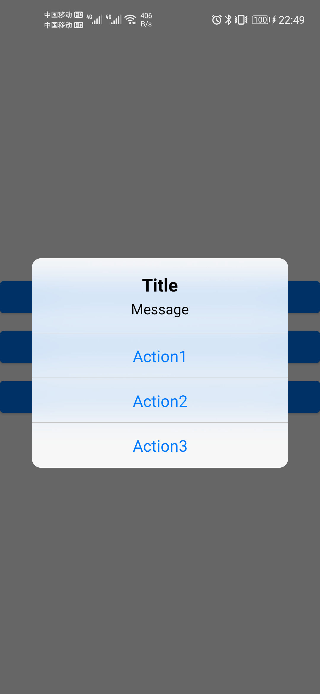
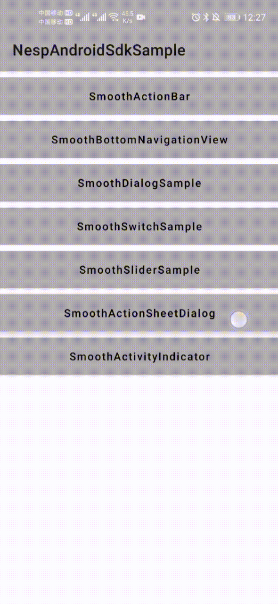
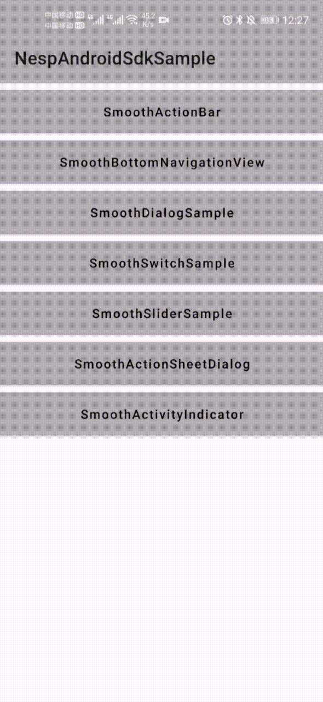

# nesp-sdk-android
Software Development Kit for Android

## Android Jetpack Encapsulation
1.ViewDataBinding（RecyclerView etc.）
2.ViewModel.
4.LiveData.
5.ROOM.

## QQ Group

## Samples

https://github.com/nespjin/NespAndroidSdkSample

## Include
1. Nesp Android Ktx.
2. Nesp Android SDK core.
3. Nesp Smooth Design.
4. Nesp DataBinding

### SmoothDesign

Widgets that have been implemented:

1.SmoothActionBar:

2.SmoothBottomNavigationView:

3.SmoothAlertDialog:

  

4. SmoothSwitch:

   

5. SmoothSlider:

   
   
6. SmoothActionSheetDialog:

   

   7. SmoothActivityIndicator:

      

## Dependencies
1. Nesp Java SDK.
2. Nesp Kotlin SDK.
3. Android Jetpack
